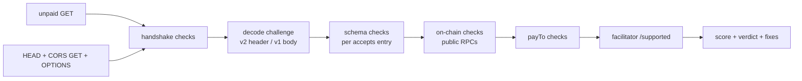

# x402-doctor

Lighthouse for x402 endpoints. Point it at a paid HTTP endpoint and it tells you, without paying, whether a real client could actually pay it, and exactly what to change if not. It's for people running x402 APIs and for agent builders deciding which ones to trust.

```
$ node dist/cli.js http://localhost:4020/weather

x402-doctor 0.1.0  GET http://localhost:4020/weather

   49/100   PAYMENTS WILL FAIL
  x402 v2   $0.01 on Base Sepolia

  Handshake
   ✓ GET returned 402 Payment Required in 54 ms.
   ✓ v2 challenge found in PAYMENT-REQUIRED header (560 chars).
   ✓ x402 v2.
   ✓ HEAD returns 402 too.
   ✗ CORS is enabled (Allow-Origin: *) but Access-Control-Expose-Headers is missing. Browsers hide PAYMENT-REQUIRED from fetch(), so browser clients see a 402 with no price and can't pay.
     fix: Add `Access-Control-Expose-Headers: PAYMENT-REQUIRED, PAYMENT-RESPONSE` to every response on paid routes (including the 402).
   ✓ Preflight allows PAYMENT-SIGNATURE.
   ✓ 54 ms to produce the 402 challenge.

  Schema
   ✓ 1 payment option(s).
   ✓ resource URL matches (http://localhost:4020/weather).
   ✓ accepts[0] has all required v2 fields.
   ✓ accepts[0] network eip155:84532.
   ✓ accepts[0] amount = 10000.
   ✓ accepts[0] maxTimeoutSeconds 60s.

  Asset (on-chain)
   ✓ accepts[0] asset has code on Base Sepolia.
   ✓ accepts[0] costs $0.01 (10000 atomic, 6 decimals, USDC).
   ✗ accepts[0] extra.name is "USD Coin" but the token's EIP-712 name is "USDC" on Base Sepolia. Clients sign with your extra, the token verifies with its own domain, so every payment signature fails (invalid_exact_evm_payload_signature). [blocks settlement]
     fix: Set extra: { name: "USDC", version: "2" }. Note testnet and mainnet USDC differ: Base Sepolia is "USDC", Base mainnet is "USD Coin".
   ✓ accepts[0] token implements EIP-3009.

  payTo
   ✓ accepts[0] payTo 0x209693Bc6afc0C5328bA36FaF03C514EF312287C.
   ✓ accepts[0] payTo is an EOA on Base Sepolia.

  Facilitator
   · accepts[0] exact on Base Sepolia is settleable by https://x402.org/facilitator, https://facilitator.payai.network.

  17 passed, 0 warnings, 2 failed, 0 inconclusive · 1757 ms · never signed or sent a payment
```

That's a real run against [`examples/broken-server.mjs`](examples/broken-server.mjs), the local demo endpoint from the quickstart. The token checks are real reads of Base Sepolia USDC through a public RPC.

## Why

An x402 endpoint can return a perfectly well-formed `402` and still be impossible to pay. The most common way is the EIP-712 domain: the server advertises `extra: { name, version }`, the client signs with it, and the token verifies with its own domain. Base mainnet USDC is named `"USD Coin"` but Base Sepolia USDC is `"USDC"`, so copying a mainnet config to testnet (or the reverse) makes every signature fail at settlement, long after the 402 looked fine. CORS is the other quiet failure: if `PAYMENT-REQUIRED` isn't in `Access-Control-Expose-Headers`, browser wallets get a 402 with no price on it.

To see how common this is, x402-doctor scanned 1,696 public endpoints from the facilitator catalogs on 2026-10-04 ([results below](#public-scan-2026-10-04)). 2.5% of the live ones advertise a payment option that can't settle, and 14.1% hide the price from browsers.

## Quickstart

x402-doctor isn't published to npm yet, so run it from a clone. Requires Node 20 or newer.

```bash
git clone https://github.com/agnij-dutta/x402-doctor.git
cd x402-doctor
npm ci
npm run build

# a local endpoint with two deliberate bugs
node examples/broken-server.mjs &

node dist/cli.js http://localhost:4020/weather                 # the output above; exits 1
node dist/cli.js http://localhost:4020/fixed                   # settles (90/100) but still exits 1 on the CORS failure
node dist/cli.js http://localhost:4020/fixed --min-score 80    # exits 0
kill %1
```

Point it at your own endpoint the same way: `node dist/cli.js https://api.example.com/paid/weather`. After the first npm release this becomes `npx x402-doctor <url>`.

## Usage

```
x402-doctor <url> [url...] [options]
x402-doctor scan [scan options]
```

### Options

| Flag                      | Default              | Description                                                                                                                 |
| ------------------------- | -------------------- | --------------------------------------------------------------------------------------------------------------------------- |
| `-X, --method <M>`        | `GET`                | HTTP method for the unpaid probe. Use it for POST-only routes.                                                              |
| `--json`                  | off                  | Print the full report as JSON (an array for several URLs).                                                                  |
| `--facilitator <url>`     | none                 | Check that this facilitator's `/supported` covers each payment option (and Solana `feePayer`).                              |
| `--rpc <caip2=url>`       | built-in public RPCs | Override the RPC for a network, e.g. `--rpc eip155:8453=https://...`. Repeatable; repeats for one network become fallbacks. |
| `--offline`               | off                  | No on-chain reads or facilitator lookups. EIP-712 checks fall back to a built-in table of verified USDC/EURC domains.       |
| `--timeout <ms>`          | `15000`              | Per-request timeout.                                                                                                        |
| `--min-score <n>`         | none                 | Exit 1 if the score is below `n` (0-100) instead of on any failure.                                                         |
| `--strict`                | off                  | Warnings fail the exit code too.                                                                                            |
| `-v, --verbose`           | off                  | Also show skipped checks.                                                                                                   |
| `--version`, `-h, --help` |                      |                                                                                                                             |

### Exit codes

| Code | Meaning                                                                        |
| ---- | ------------------------------------------------------------------------------ |
| `0`  | No failed checks (or score at or above `--min-score`).                         |
| `1`  | At least one failed check, or below `--min-score`.                             |
| `2`  | Inconclusive: network error, rate limit, WAF, or an RPC outage hid the answer. |
| `64` | Usage error (bad flag, bad URL).                                               |
| `70` | Internal error. Please file a bug.                                             |

### Scan options

| Flag                  | Default                           | Description                                                                                  |
| --------------------- | --------------------------------- | -------------------------------------------------------------------------------------------- |
| `--out <dir>`         | `./scan`                          | Output directory.                                                                            |
| `--per-host <n>`      | `2`                               | Max endpoints sampled per host.                                                              |
| `--limit <n>`         | none                              | Max endpoints to probe in total.                                                             |
| `--concurrency <n>`   | `4`                               | Parallel probes. Capped at 4.                                                                |
| `--catalog <file>`    | `<out>/cache/catalog-<date>.json` | Reuse a cached discovery catalog.                                                            |
| `--timeout <ms>`      | `15000`                           | Per-request timeout.                                                                         |
| `--rebuild-report`    | off                               | Re-aggregate `REPORT.md` and `<date>.json` from the local raw file without probing anything. |
| `--date <YYYY-MM-DD>` | today                             | Which raw file `--rebuild-report` uses.                                                      |

### Environment variables

All optional. See [`.env.example`](.env.example).

| Variable                    | Description                                                                                                                                         |
| --------------------------- | --------------------------------------------------------------------------------------------------------------------------------------------------- |
| `X402_DOCTOR_RPC_<chainId>` | RPC URL(s) for an EVM chain, comma-separated, e.g. `X402_DOCTOR_RPC_8453`. `--rpc` takes precedence.                                                |
| `X402_DOCTOR_RPC_<CAIP2>`   | Same for non-EVM networks: the CAIP-2 id upper-cased with non-alphanumerics as `_`, e.g. `X402_DOCTOR_RPC_SOLANA_5EYKT4USFV8P8NJDTREPY1VZQKQZKVDP`. |
| `NO_COLOR` / `FORCE_COLOR`  | Terminal colors.                                                                                                                                    |

### In CI

The composite action in this repo builds the CLI and runs it (see [`examples/github-workflow.yml`](examples/github-workflow.yml)):

```yaml
- uses: agnij-dutta/x402-doctor@v0
  with:
    urls: https://api.example.com/paid/weather https://api.example.com/paid/search
    min-score: "90"
```

Inputs: `urls` (required, space-separated), `method`, `min-score`, `facilitator`, `strict`.

### Library

```ts
import { doctor } from "x402-doctor";

const report = await doctor("https://api.example.com/paid/weather", {
  facilitator: "https://x402.org/facilitator",
});
if (report.settlementBroken) {
  for (const c of report.checks.filter((c) => c.status === "fail")) console.log(c.message, c.fix);
}
```

| Export                                                                                                | Description                                                                                                                                                                  |
| ----------------------------------------------------------------------------------------------------- | ---------------------------------------------------------------------------------------------------------------------------------------------------------------------------- |
| `doctor(url, options?)`                                                                               | Probe one endpoint. Resolves to a `Report`; never throws on network errors (they become `unknown` checks).                                                                   |
| `renderPretty(report, { verbose? })` / `renderJson(report)`                                           | The CLI's two output formats.                                                                                                                                                |
| `score(checks)` / `summarize(checks, acceptCount, inconclusive)` / `WEIGHTS`                          | Scoring: 100 minus 25 per settlement-blocking failure, 10 per other failure, 3 per warning. A missing 402 scores 0 and any settlement-blocking failure caps the score at 49. |
| `decodeHeaderValue(value)` / `buildChallenge(json, source)` / `normalizeRequirement(raw, i, version)` | Challenge decoding and v1/v2 normalization.                                                                                                                                  |
| `domainSeparator(name, version, chainId, verifyingContract)`                                          | EIP-712 domain separator.                                                                                                                                                    |
| `RpcClient`                                                                                           | Keyless JSON-RPC client with fallback and caching; pass one as `rpcClient` to share it across probes.                                                                        |
| `DEFAULT_RPCS`, `PUBLIC_FACILITATORS`, `VERSION`                                                      | Built-in tables.                                                                                                                                                             |
| Types                                                                                                 | `Report`, `Check`, `Challenge`, `NormalizedRequirement`, `PriceInfo`, `DoctorOptions`, ...                                                                                   |

`DoctorOptions`: `method`, `timeoutMs`, `userAgent`, `rpc` (CAIP-2 to URL or URLs), `facilitator`, `offline`, `checkPublicFacilitators` (default: on unless offline), `publicFacilitators`, `corsOrigin`, `fetch`, `rpcClient`.

`Report`: `score`, `verdict` (`pass` | `warn` | `fail` | `unknown`), `settlementBroken` (some option can't settle), `noWorkingOption` (none can), `version`, `challenge`, `prices`, `checks[]` (`id`, `status`, `critical`, `accept`, `message`, `fix`, `data`), timing.

## What it checks

Each check is `pass`, `warn`, `fail`, `skip` or `unknown`. Failures marked **blocks settlement** mean a correctly written client cannot complete a payment with that option; they set `settlementBroken` and cap the score at 49. Network errors, rate limits, WAF pages and RPC outages are always `unknown`, never `fail`.

### Handshake

| Check                        | Fails or warns when                                                                                                                                                                                                                                                                                         | Fix it reports                                                                                          |
| ---------------------------- | ----------------------------------------------------------------------------------------------------------------------------------------------------------------------------------------------------------------------------------------------------------------------------------------------------------- | ------------------------------------------------------------------------------------------------------- |
| `handshake.reachable`        | DNS, TLS, timeout or connection error (`unknown`).                                                                                                                                                                                                                                                          | Fix TLS / check the URL.                                                                                |
| `handshake.status-402`       | The unpaid request doesn't get `402`: a `2xx` means the resource is free, `401`/`403` stops x402 clients, `404`/`405` usually means the paywall is on another method. **Blocks settlement.** A `402` from Vercel's `DEPLOYMENT_DISABLED` page is attributed to the platform. `429`/`5xx`/WAF are `unknown`. | Mount the payment middleware on this route and method; return 402, not 401/403.                         |
| `handshake.challenge-decode` | No readable challenge: no `PAYMENT-REQUIRED` header and no v1 body; header not standard base64 (base64url is rejected by the reference client); v2 challenge only in the body (reference clients only read the body for v1). **Blocks settlement.**                                                         | Send the v2 challenge as standard base64 JSON in `PAYMENT-REQUIRED`.                                    |
| `handshake.version`          | The `PAYMENT-REQUIRED` header carries a version other than 2 (fail; **blocks settlement** unless it's a complete v1 challenge). Warns when header and body disagree, or the challenge is legacy v1.                                                                                                         | Serve one complete version; move to v2.                                                                 |
| `handshake.cors-expose`      | CORS is on but `PAYMENT-REQUIRED` isn't in `Access-Control-Expose-Headers` (fail: browsers see a 402 with no price). Warns when there's no CORS at all, or only `PAYMENT-RESPONSE` is missing. `*` doesn't count when credentials are allowed.                                                              | `Access-Control-Expose-Headers: PAYMENT-REQUIRED, PAYMENT-RESPONSE`.                                    |
| `handshake.cors-preflight`   | The `OPTIONS` preflight doesn't allow `PAYMENT-SIGNATURE` (v2) or `X-PAYMENT` (v1), so browsers block the paid retry.                                                                                                                                                                                       | Add the payment header to `Access-Control-Allow-Headers`.                                               |
| `handshake.head`             | `HEAD` is served without payment (warn).                                                                                                                                                                                                                                                                    | Gate `HEAD` too, or don't expose it.                                                                    |
| `handshake.latency`          | The 402 takes more than 1 s (warn).                                                                                                                                                                                                                                                                         | Build the challenge statically; don't call the facilitator or chain before answering an unpaid request. |

### Schema (per payment option)

| Check                                     | Fails or warns when                                                                                                                                                                                                                             | Fix it reports                                       |
| ----------------------------------------- | ----------------------------------------------------------------------------------------------------------------------------------------------------------------------------------------------------------------------------------------------- | ---------------------------------------------------- |
| `schema.accepts`                          | `accepts[]` is missing or empty. **Blocks settlement.**                                                                                                                                                                                         | Advertise at least one option.                       |
| `schema.required-fields`                  | A required field for the version is missing. Fails (blocking) for `scheme`, `network`, amount, `asset`, `payTo`; warns for the rest.                                                                                                            | Add the field.                                       |
| `schema.amount-field`                     | v1 uses `amount` or v2 uses `maxAmountRequired`. **Blocks settlement.**                                                                                                                                                                         | Use the version's field name.                        |
| `schema.network`                          | v2 uses a v1 name like `base` (**blocks settlement**, with the CAIP-2 id to use), or v1 uses CAIP-2. Warns for `namespace:reference` ids that miss strict CAIP-2 and for unknown networks.                                                      | Use `eip155:8453`-style ids in v2.                   |
| `schema.amount-format`                    | EVM/Solana amount isn't an atomic-unit integer string: `"0.01"`, a JSON number. **Blocks settlement**, and the fix gives the atomic value. Warns on `0` and leading zeros. Not judged on networks that use decimal amounts (XRPL, Hyperliquid). | `"10000"` for $0.01 of a 6-decimal token.            |
| `schema.timeout`                          | `maxTimeoutSeconds` isn't a positive integer, or is under 10 s or over an hour (warn).                                                                                                                                                          | 30 to 300 s.                                         |
| `schema.resource` / `schema.resource-url` | v2 `resource.url` missing, or doesn't match the URL you requested (warn).                                                                                                                                                                       | Set it to the paid URL.                              |
| `schema.scheme`                           | Unknown scheme (warn).                                                                                                                                                                                                                          | `exact`, `upto`, ...                                 |
| `schema.extra`                            | `extra` isn't an object. **Blocks settlement.**                                                                                                                                                                                                 |                                                      |
| `schema.eip712-extra`                     | EVM `exact` with EIP-3009 but no `extra.name` / `extra.version`. **Blocks settlement** (the reference client won't sign).                                                                                                                       | Add the token's EIP-712 name and version.            |
| `schema.transfer-method`                  | `extra.assetTransferMethod` isn't `eip3009`, `permit2` or `erc7710` (warn: only clients that know the extension can pay).                                                                                                                       | Use a spec method, or also offer one.                |
| `schema.svm-feepayer`                     | Solana `exact` without `extra.feePayer`. **Blocks settlement.**                                                                                                                                                                                 | Copy `feePayer` from the facilitator's `/supported`. |

### Asset (on-chain)

| Check                                                   | Fails or warns when                                                                                                                                                                                                                                                                                                                                                                                                                                  | Fix it reports                                        |
| ------------------------------------------------------- | ---------------------------------------------------------------------------------------------------------------------------------------------------------------------------------------------------------------------------------------------------------------------------------------------------------------------------------------------------------------------------------------------------------------------------------------------------- | ----------------------------------------------------- |
| `asset.address`                                         | Asset isn't a valid EVM address / Solana pubkey. **Blocks settlement.**                                                                                                                                                                                                                                                                                                                                                                              |                                                       |
| `asset.checksum`                                        | Bad EIP-55 checksum (warn).                                                                                                                                                                                                                                                                                                                                                                                                                          |                                                       |
| `asset.exists`                                          | No contract code (EVM) or no mint (Solana) on the declared network, or the Solana account isn't an SPL mint. **Blocks settlement.** Names the network the address does exist on when it's a known token.                                                                                                                                                                                                                                             | Fix the network or the address.                       |
| `asset.decimals` / `asset.price` / `asset.price-sanity` | Token doesn't answer `decimals()` (warn); computes the human price; warns when the price is $100 or more, or when a short amount is applied to an 18-decimal token.                                                                                                                                                                                                                                                                                  |                                                       |
| `asset.eip712-domain`                                   | `extra.name`/`extra.version` don't reproduce the domain the signature is verified against. Compared to `DOMAIN_SEPARATOR()` exactly, then `eip712Domain()` (EIP-5267), then `name()`/`version()`. **Blocks settlement** for EIP-3009. If `extra.verifyingContract` names a separate contract (e.g. Circle Gateway batched settlement), it checks that contract and reports a mismatch as `unknown`, because those signatures are verified off-chain. | The exact `{ name, version }` the chain expects.      |
| `asset.eip3009`                                         | Default EIP-3009 transfer, but the token has no `transferWithAuthorization` (`authorizationState()` reverts). **Blocks settlement.**                                                                                                                                                                                                                                                                                                                 | Use `assetTransferMethod: "permit2"` or a 3009 token. |
| `asset.permit2-proxy` / `asset.permit2-deployed`        | Permit2 option names a spender other than the canonical x402 proxy, or Permit2 / the proxy isn't deployed on the chain. **Blocks settlement.**                                                                                                                                                                                                                                                                                                       |                                                       |
| `asset.svm-feepayer`                                    | `extra.feePayer` isn't a valid Solana pubkey. **Blocks settlement.**                                                                                                                                                                                                                                                                                                                                                                                 |                                                       |
| `asset.onchain` / `asset.supported`                     | Skipped: no RPC for the network, or on-chain checks for that family aren't implemented.                                                                                                                                                                                                                                                                                                                                                              |                                                       |

### payTo

| Check            | Fails or warns when                                                                                                                            | Fix it reports |
| ---------------- | ---------------------------------------------------------------------------------------------------------------------------------------------- | -------------- |
| `payTo.valid`    | Wrong format for the network (an EVM address on Solana, ...), the zero address, or the token / Permit2 contract itself. **Blocks settlement.** |                |
| `payTo.checksum` | Bad EIP-55 checksum (warn).                                                                                                                    |                |
| `payTo.contract` | `payTo` is a contract (warn: fine for a smart wallet, wrong if it's a token or a typo).                                                        |                |

### Facilitator

| Check                   | Fails or warns when                                                                                                                       | Fix it reports                         |
| ----------------------- | ----------------------------------------------------------------------------------------------------------------------------------------- | -------------------------------------- |
| `facilitator.supported` | With `--facilitator`: its `/supported` doesn't list the option's version, scheme and network. **Blocks settlement** for that facilitator. | Use a facilitator that supports it.    |
| `facilitator.feepayer`  | With `--facilitator`: Solana `extra.feePayer` isn't the facilitator's. **Blocks settlement.**                                             | Copy `feePayer` from its `/supported`. |
| `facilitator.public`    | Without `--facilitator`: lists which keyless public facilitators (`x402.org/facilitator`, PayAI) could settle each option. Informational. |                                        |

## How it works



1. **Probe.** `src/http.ts` sends the unpaid request, then `HEAD`, a `GET` with an `Origin` header, and an `OPTIONS` preflight that asks for the payment header. No payment headers are ever sent.
2. **Decode.** `src/decode.ts` reads the v2 `PAYMENT-REQUIRED` header (standard base64 JSON) or the v1 JSON body and normalizes both versions into one shape, including v1 network names to CAIP-2.
3. **Check.** Each module in `src/checks/` returns a list of `Check`s. The on-chain modules call `eth_getCode`, `eth_call` (`DOMAIN_SEPARATOR`, `eip712Domain`, `name`, `version`, `decimals`, `authorizationState`) and Solana `getAccountInfo` through `src/rpc.ts`, which falls back across public RPCs and caches answers but never errors.
4. **Score.** `src/doctor.ts` combines the checks into a score, a verdict and the two settlement flags.

The EIP-712 check recomputes `keccak256(abi.encode(typeHash, keccak(name), keccak(version), chainId, verifyingContract))` locally (`src/evm.ts`) and compares it to the token's `DOMAIN_SEPARATOR()`. That catches wrong `chainId`/`verifyingContract` assumptions as well as name and version typos, and it tells you which name/version pair the chain actually expects.

## Public scan (2026-10-04)

`x402-doctor scan` does the same probe across public endpoints. Full results: [`scan/REPORT.md`](scan/REPORT.md); anonymized per-endpoint data: [`scan/2026-10-04.json`](scan/2026-10-04.json).

**Method**

- **Discovery:** the keyless Bazaar listings of the Coinbase CDP facilitator (29,326 listed) and the PayAI facilitator (12,528 listed), fetched 2026-10-04: 38,020 unique URLs on 2,780 hosts.
- **Sampling:** catalog entries that accept GET, 1 per host (`--per-host 1`), in stable hash order: 1,696 endpoints. 18,092 POST-only entries were not probed.
- **Probe:** unpaid `GET`, `HEAD`, a CORS `GET` and an `OPTIONS` preflight. At most 4 hosts at a time, one request at a time per host, `x402-doctor/0.1.0` User-Agent, no payment headers.
- **Confirmation:** every endpoint that failed was re-probed serially about a second later, and only failures that reproduced count. Rate limits, timeouts, WAF pages and RPC errors are inconclusive, never failures.
- **Review:** the first pass reported 7.8% settlement-broken. Reviewing the raw failures turned up four false-positive classes in x402-doctor itself: Circle Gateway `verifyingContract` domains, XRPL decimal amounts, non-strict CAIP-2 ids, and Vercel `DEPLOYMENT_DISABLED` 402s. All four were fixed with regression tests, and the 96 affected endpoints were re-probed with the same confirmation. The numbers below are the corrected ones.
- **Where it ran:** a single macOS machine, with on-chain reads through the built-in public RPCs. Latency figures reflect that vantage point.

**Results** (live = answered with a readable x402 challenge)

|                                                |                                              |
| ---------------------------------------------- | -------------------------------------------- |
| Endpoints probed / hosts                       | 1,696 / 1,696                                |
| Live x402 endpoints                            | 1,359                                        |
| No confirmed failures                          | 81.8% (1,112)                                |
| At least one option can't settle               | 2.5% (34)                                    |
| No working option at all                       | 1.3% (17)                                    |
| CORS hides `PAYMENT-REQUIRED` from browsers    | 14.1% (192)                                  |
| Preflight blocks the payment header            | 9.7% (132)                                   |
| Most common settlement-blocking failure        | v1 network name in a v2 challenge, 1.0% (13) |
| Listed but gone (404/410) / served free on GET | 128 / 45                                     |
| Median price per request                       | $0.01 (p25 $0.005, p75 $0.03)                |
| Median 402 latency / p90                       | 703 ms / 1,370 ms                            |

Separately, a static audit of every EVM EIP-3009 option in both catalogs (36,353 resources, no endpoint contacted) found 49 resources whose declared EIP-712 domain doesn't match the token on-chain.

**Privacy:** the published JSON uses random per-report host ids, so it can't be joined back to the catalog. Per-endpoint raw data (`scan/raw/`) is gitignored and stays local so owners can be told privately before anything is named.

## Security model and limitations

- **It never pays.** No keys, no signatures, no `PAYMENT-SIGNATURE` / `X-PAYMENT` / `Authorization` headers (there's a test for this). With `-X POST` it sends an empty unpaid POST, so only use that on routes where an unpaid request has no side effects.
- **A pass is not proof that payments settle.** x402-doctor checks the advertised challenge and chain state. It can't see whether the server verifies payments correctly, whether the facilitator has gas, or what the paid response is. The only full proof is a real payment, ideally on testnet through the facilitator you use.
- **It trusts the RPC.** Public RPCs can be stale, rate-limited or wrong. RPC errors become `unknown`, but a wrong answer can't be detected. Use `--rpc` with a node you trust for anything important.
- **The endpoint can lie.** A server can answer the probe differently from real clients (by User-Agent, IP or timing).
- **Separate verifiers are out of reach.** Options that sign for an off-chain verifier (e.g. Circle Gateway batched settlement) are reported as `unknown`.
- **Coverage:** on-chain checks are EVM (`eip155:*`) and Solana. Other networks (XRPL, Algorand, Aptos, Stellar, Sui, ...) get schema checks only. `upto`, `batch-settlement` and newer schemes get generic checks, not scheme-specific ones.

See [SECURITY.md](SECURITY.md) to report a vulnerability.

## Prior art

- [x402](https://github.com/x402-foundation/x402) (x402 Foundation, previously `coinbase/x402`): the spec, reference clients, middleware and facilitator. x402-doctor's rules come from its `specs/` and from the reference client's behavior. The facilitator's `/verify` only checks a signed payment after a client has paid; x402-doctor checks the advertised challenge before anyone pays.
- [x402scan](https://x402scan.com): an explorer of x402 activity and resources. It shows what exists; x402-doctor checks whether it can be paid.
- The facilitator **Bazaar** discovery endpoints (CDP, PayAI): the catalogs the scan reads.
- [Lighthouse](https://developer.chrome.com/docs/lighthouse): the model for the output, a score plus a fix for each audit.

What x402-doctor adds: a single command that checks the whole path a payment takes (HTTP, encoding, CORS, schema, token contract, EIP-712 domain, recipient, facilitator) without paying, and a reproducible, failure-confirmed measurement of how the public ecosystem is doing.

## Roadmap

- Publish to npm so `npx x402-doctor` works, and tag `v0` for the GitHub Action.
- On-chain checks for more x402 networks (Aptos, Stellar, Sui, Algorand, XRPL), and scheme-specific checks for `upto` and `batch-settlement`.
- An opt-in testnet mode that signs a throwaway authorization and calls the facilitator's `/verify` (still never settles), to cover what static checks can't.
- Share the challenge decoder and network tables with `paydecode` (a separate x402/AP2 wire-format decoder, not yet published) instead of keeping a local copy.
- Recurring public scans with a diff against the previous run, and private notification to owners of broken endpoints before any per-host data is published.
- Probe POST-only catalog entries using the request schema the Bazaar listing declares.

## Contributing

See [CONTRIBUTING.md](CONTRIBUTING.md), including how to add a check. Changes are tracked in [CHANGELOG.md](CHANGELOG.md).

## License

[MIT](LICENSE)

## Author

Agnij Dutta ([@0xholmesdev](https://x.com/0xholmesdev))
